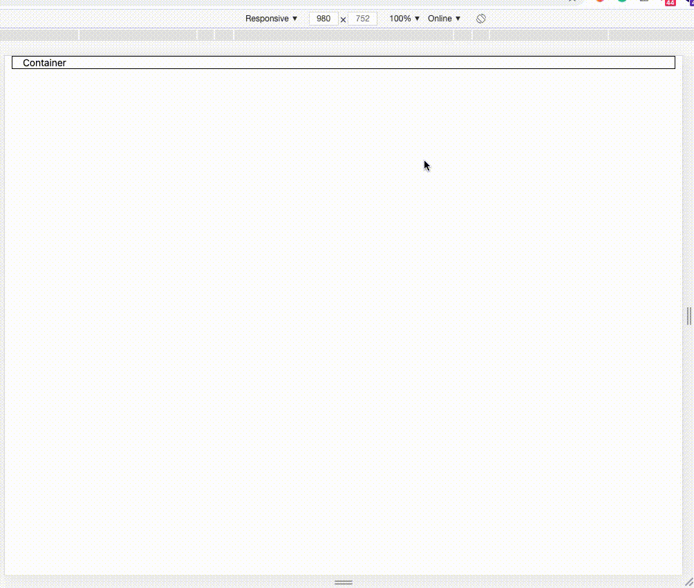
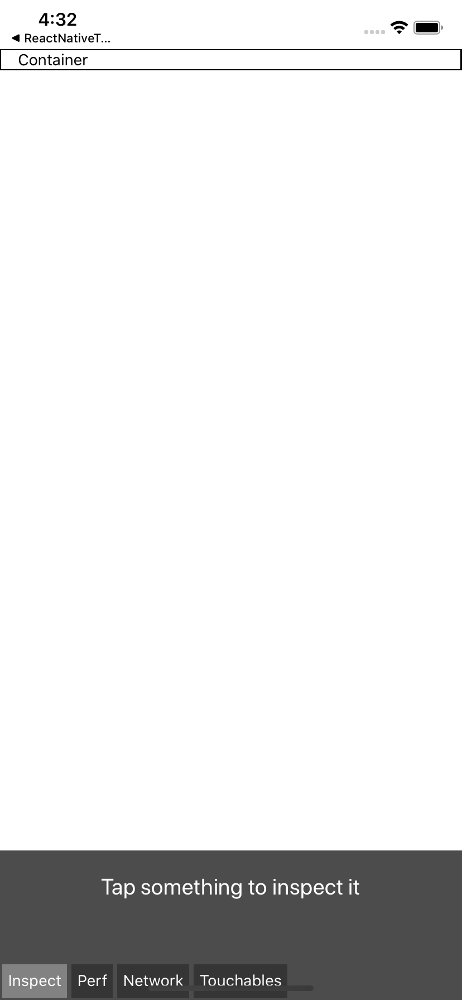
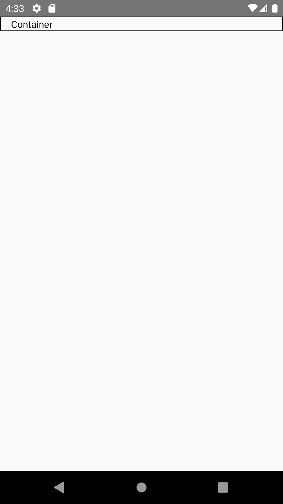
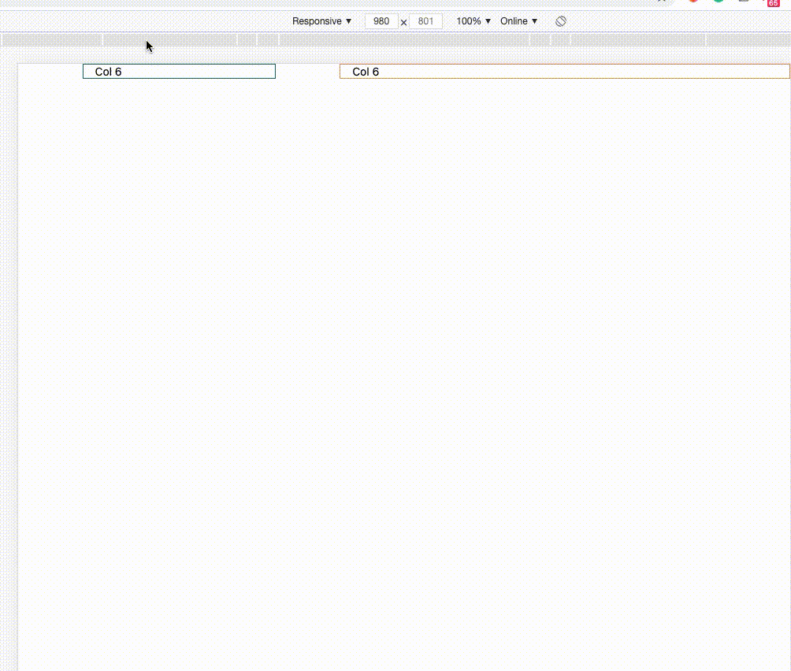
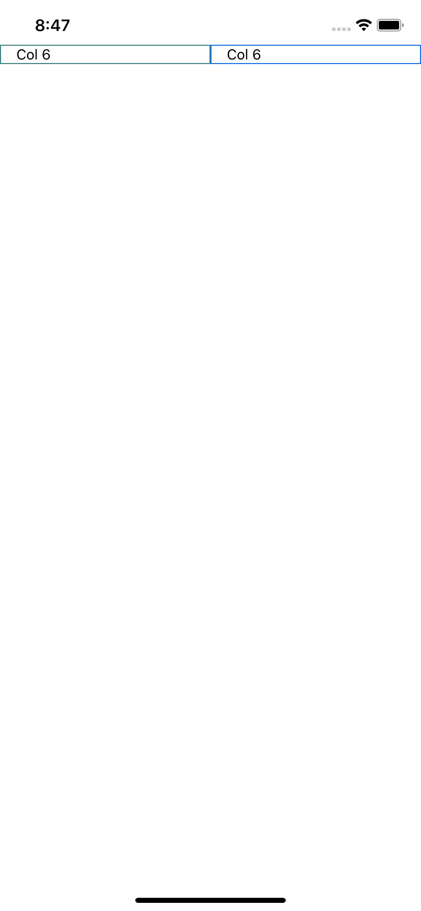
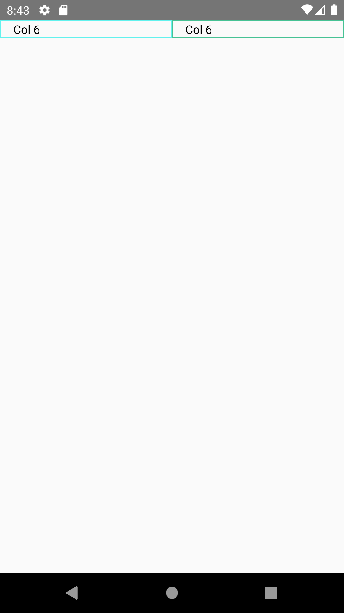

# ReactstrapNativeWeb
This is project create support library bootstrap on react native and react native web

# Table of contents
* [Installation](#installation) 
* [Global Style](#global-style)
    - [Setup](#setup)
    - [Document Structure Dynamic Theme](#document-structure-dynamic-theme)
    - [Text Color](#text-color)
    - [Background Color](#background-color)
    - [Border Color](#border-color)
    - [Border Width](#border-width)
    - [Padding](#padding)
    - [Margin](#margin)
    - [Width and Height](#width-and-height)
    - [Display](#display)
    - [Overflow](#overflow)
    - [Position](#position)
    - [ZIndex](#zindex)
    - [Font Size](#font-size)
    - [Font Weight](#font-weight)
    - [Letter Spacing](#letter-spacing)
    - [Line Height](#line-height)
    - [Text Align](#text-align)
    - [Text Decoration](#text-decoration)
    - [Text Transform](#text-transform)
    - [Flex Direction](#flex-direction)
    - [Flex Wrap](#flex-wrap)
    - [Align Items](#align-items)
    - [Align Content](#align-content)
    - [Align Self](#align-self)
    - [Justify Content](#justify-content)
    - [Flex](#flex)
    - [Flex Grow](#flex-grow)
    - [Flex Shrink](#flex-shrink)
* [Container Component](#container-component)
    - [Usage](#usage)
    - [Document](#document)
    - [Example with default container and enable debug](#example-with-default-container-and-enable-debug)
* [Row Component](#row-component)
    - [Usage](#usage)
    - [Document](#document)
* [Col Component](#col-component)
    - [Usage](#usage)
    - [Document](#document)
    - [Example](#example)
* [Image Component](#image-component)
    - [Usage](#usage)
    - [Document](#document)
    - [Example](#example)
* [TextShadow Component](#textshadow-component)   
    - [Usage](#usage)
    - [Document](#document)
    - [Example](#example) 
* [Inspired by](#inspired-by)
* [Contributing](#contributing)
* [Author](#author)
* [License](#license)
    
## Installation

If using yarn:
```
yarn add reactstrap-native-web@beta
```
If using npm:
```
npm i reactstrap-native-web@beta
```
## Global Style
### Setup
   1. Create file styles any (recommended use name: theme.style.js or theme.style.ts if you use the typescript in a folder style)
   2. Load theme `default` or `dynamic theme` you want.
        ```jsx
        import {buildTheme} from 'reactstrap-native-web';
        import {StyleSheet} from 'react-native'  
        const themes = buildTheme({
          lightTheme: {
            spacer: 30,  
            colors: {
              primary: 'red',
            },
          },
        });

        export const bootstrap = StyleSheet.create(themes.default.styleSheet);
        export const lightTheme = StyleSheet.create(themes.lightTheme.styleSheet);
        ```
        And then you can import global style anywhere
        `Note`: when we define `colors` variable for any theme will auto-generate text color, background color, and border color equivalent
              Beside about `spacer` variable will auto-generate margin and padding equivalent please reference [spacing](https://getbootstrap.com/docs/4.5/utilities/spacing/)
   3. Theme defaults similar :root of bootstrap
        ```jsx
        export default {
          spacer: 16,
          colors: {
            blue: '#007bff',
            indigo: '#6610f2',
            purple: '#6f42c1',
            pink: '#e83e8c',
            red: '#dc3545',
            orange: '#fd7e14',
            yellow: '#ffc107',
            green: '#28a745',
            teal: '#20c997',
            cyan: '#17a2b8',
            white: '#fff',
            gray: '#6c757d',
            grayDark: '#343a40',
            primary: '#007bff',
            secondary: '#6c757d',
            success: '#28a745',
            info: '#17a2b8',
            warning: '#ffc107',
            danger: '#dc3545',
            light: '#f8f9fa',
            dark: '#343a40',
          },
        };
        ```    
### Document Structure Dynamic Theme
| Name | Description | Default | Type | Required |
|:-----|:------------|:--------|:-----|:---------|
| colors | Define color for your dynamic theme or override theme default | None | Object | false |
| spacer | Number present size please reference [spacing](https://getbootstrap.com/docs/4.5/utilities/spacing/) | 16 | Number | false | 
### Text Color
   - Generate when we setting `colors`
   - Example:
   ```jsx
        import {buildTheme} from 'reactstrap-native-web';
        import {StyleSheet} from 'react-native'   
        const themes = buildTheme({
            lightTheme: {
               spacer: 30,  
               colors: {
                 primary: 'red',
               },
            },
        });
   
        export const bootstrap = StyleSheet.create(themes.default.styleSheet);
        export const lightTheme = StyleSheet.create(themes.lightTheme.styleSheet);
   ```

   - Auto generate `text color` for `lightTheme`:
   
   ```jsx
      import {StyleSheet} from "react-native";

      StyleSheet.create({
        textPrimary: {
            color: 'red'        
        }   
      })  
   ```
   - we can access style in code the following:
   ```jsx
        export const ExampleComponent = () => {
            return (
                <View style={lightTheme.textPrimary}/>
            );   
        }   
   ```
  
### Background Color
   - Generate when we setting `colors`
   - Example:
   ```jsx
        import {buildTheme} from 'reactstrap-native-web';
        import {StyleSheet} from 'react-native'   
        const themes = buildTheme({
            lightTheme: {
                spacer: 30,  
                colors: {
                    primary: 'red',
                },
            },
        });
       
        export const bootstrap = StyleSheet.create(themes.default.styleSheet);
        export const lightTheme = StyleSheet.create(themes.lightTheme.styleSheet);
   ```
    
   - Auto generate `background color` for `lightTheme`:
       
   ```jsx
        import {StyleSheet} from "react-native";
    
        StyleSheet.create({
            bgPrimary: {
                backgroundColor: 'red'        
            }   
        })  
   ```
   - we can access style in code the following:
   ```jsx
        export const ExampleComponent = () => {
            return (
                <View style={lightTheme.bgPrimary}/>
            );   
        }   
   ```
### Border Color
   - Generate when we setting `colors`
   - Example:
   ```jsx
        import {buildTheme} from 'reactstrap-native-web';
        import {StyleSheet} from 'react-native'   
        const themes = buildTheme({
            lightTheme: {
                spacer: 30,  
                colors: {
                    primary: 'red',
                },
            },
        });
       
        export const bootstrap = StyleSheet.create(themes.default.styleSheet);
        export const lightTheme = StyleSheet.create(themes.lightTheme.styleSheet);
   ```
    
   - Auto generate `border color` for `lightTheme`:
       
   ```jsx
        import {StyleSheet} from "react-native";
    
        StyleSheet.create({
            borderPrimary: {
              borderColor: 'red',    
            },
            borderFullPrimary: {
              borderWidth: 1,
              borderColor: 'red',
              borderStyle: 'solid',     
            },
            borderBottomPrimary: {
              borderBottomColor: 'red',
              borderBottomWidth: 1,
              borderStyle: 'solid',
            },
            borderLeftPrimary: {
              borderLeftColor: 'red',
              borderLeftWidth: 1,
              borderStyle: 'solid',
            },
            borderRightPrimary: {
              borderRightColor: 'red',
              borderRightWidth: 1,
              borderStyle: 'solid',
            },
            borderTopPrimary: {
               borderTopColor: 'red',
               borderTopWidth: 1,
               borderStyle: 'solid',
            }                            
        })  
   ```
   - we can access style in code the following:
   ```jsx
        export const ExampleComponent = () => {
            return (
                <View style={lightTheme.borderFullPrimary}/>
            );   
        }   
   ```
### Border Width
   - Generate when we setting `spacer`
   - Example:
   ```jsx
        import {buildTheme} from 'reactstrap-native-web';
        import {StyleSheet} from 'react-native'   
        const themes = buildTheme({
            lightTheme: {
                spacer: 30,  
                colors: {
                    primary: 'red',
                },
            },
        });
       
        export const bootstrap = StyleSheet.create(themes.default.styleSheet);
        export const lightTheme = StyleSheet.create(themes.lightTheme.styleSheet);
   ```
    
   - Auto generate `border width` for `lightTheme`:
       
   ```jsx
        import {StyleSheet} from "react-native";
    
        StyleSheet.create({
            border0: {
                borderWidth: 0,
            },
            borderB0: {
                borderBottomWidth: 0,
            },
            borderE0: {
                borderEndWidth: 0,
            },
            borderL0: {
                borderLeftWidth: 0,
            },
            borderR0: {
                borderRightWidth: 0,
            },
            borderS0: {
                borderStartWidth: 0,
            },
            borderT0: {
                borderTopWidth: 0,
            },
            borderX0: {
                borderRightWidth: 0,
                borderLeftWidth: 0,
            },
            borderY0: {
                borderBottomWidth: 0,
                borderTopWidth: 0,
            },
            ... generate => spacer / 2 ,  
            border15: {
                borderWidth: 15,
            }                    
                 
        })  
   ```
   - we can access style in code the following:
   ```jsx
        export const ExampleComponent = () => {
            return (
                <View style={lightTheme.border3}/>
            );   
        }   
   ```
### Padding
   - Generate when we setting `spacer`
   - Example:
   ```jsx
        import {buildTheme} from 'reactstrap-native-web';
        import {StyleSheet} from 'react-native'   
        const themes = buildTheme({
            lightTheme: {
                spacer: 30,  
                colors: {
                    primary: 'red',
                },
            },
        });
       
        export const bootstrap = StyleSheet.create(themes.default.styleSheet);
        export const lightTheme = StyleSheet.create(themes.lightTheme.styleSheet);
   ```
    
   - Auto generate `padding` for `lightTheme` according to the rate of [spacing](https://getbootstrap.com/docs/4.5/utilities/spacing/) of the bootstrap
       
   ```jsx
        import {StyleSheet} from "react-native";
    
        StyleSheet.create({
            p0: {
                padding: 0,
            },
            pb0: {
                paddingBottom: 0,
            },
            pl0: {
                paddingLeft: 0,
            },
            pt0: {
                paddingTop: 0,
            },
            pr0: {
                paddingRight: 0,
            },
            px0: {
                paddingHorizontal: 0,
            },
            py0: {
                paddingVertical: 0,
            },
            ... generate => 5,
            p5: {
                padding: spacer * 3,
            }   
        })  
   ```
   - we can access style in code the following:
   ```jsx
        export const ExampleComponent = () => {
            return (
                <View style={lightTheme.p3}/>
            );   
        }   
   ```
### Margin
   - Generate when we setting `spacer`
   - Example:
   ```jsx
        import {buildTheme} from 'reactstrap-native-web';
        import {StyleSheet} from 'react-native'   
        const themes = buildTheme({
            lightTheme: {
                spacer: 30,  
                colors: {
                    primary: 'red',
                },
            },
        });
       
        export const bootstrap = StyleSheet.create(themes.default.styleSheet);
        export const lightTheme = StyleSheet.create(themes.lightTheme.styleSheet);
   ```
    
   - Auto generate `margin` for `lightTheme` according to the rate of [spacing](https://getbootstrap.com/docs/4.5/utilities/spacing/) of the bootstrap
       
   ```jsx
        import {StyleSheet} from "react-native";
    
        StyleSheet.create({
            m0: {
                margin: 0,
            },
            mb0: {
                marginBottom: 0,
            },
            ml0: {
                marginLeft: 0,
            },
            mt0: {
                marginTop: 0,
            },
            mr0: {
                marginRight: 0,
            },
            mx0: {
                marginHorizontal: 0,
            },
            my0: {
                marginVertical: 0,
            },
            ... generate => 5,
            m5: {
                margin: spacer * 3,
            }   
        })  
   ```
   - we can access style in code the following:
   ```jsx
        export const ExampleComponent = () => {
            return (
                <View style={lightTheme.m3}/>
            );   
        }   
   ```
### Width and Height
   - Inspiration from library [react-native-tailwindcss](https://tvke.github.io/react-native-tailwindcss/sizing/width.html)
### Display
| Class  | Properties       |
|:-------|:-----------------|
| flex   | display: 'flex'  |      
| hidden | display: 'none'  | 
### Overflow
| Class             | Properties            |
|:------------------|:----------------------|
| overflowVisible   | overflow: 'visible'   |
| overflowHidden    | overflow: 'hidden'    |
### Position
| Class     | Properties                                |
|:----------|:------------------------------------------|
| relative  | position: 'relative'                      |
| absolute  | position: 'absolute'                      |
| inset0    | top: 0, bottom: 0, left: 0, right: 0      |
| insetY0   | top: 0, bottom: 0                         | 
| insetX0   | left: 0, right: 0                         |
| top0      | top: 0                                    |
| right0    | right: 0                                  |
| bottom0   | bottom: 0                                 |
| left0     | left: 0                                   |
### ZIndex
| Class | Properties    | 
|:------|:--------------|
| z0    | zIndex: 0     |
| z10   | zIndex: 10    |
| z20   | zIndex: 20    |
| z30   | zIndex: 30    |
| z40   | zIndex: 50    |
| z50   | zIndex: 50    |
### Font Size
| Class     | Properties    |
|:----------|:--------------|
| textXs    | fontSize: 12  | 
| textSm	| fontSize: 14  |
| textBase	| fontSize: 16  |
| textLg	| fontSize: 18  |
| textXl	| fontSize: 20  |
| text2xl	| fontSize: 24  |
| text3xl	| fontSize: 30  |
| text4xl	| fontSize: 36  |
| text5xl	| fontSize: 48  |
| text6xl	| fontSize: 64  |
### Font Weight
| Class         | Properties            |
|:--------------|:----------------------|
| fontHairline  | fontWeight: 100       |
| fontThin	    | fontWeight: 200       |
| fontLight     | fontWeight: 300       |
| fontNormal	| fontWeight: 'normal'  |
| fontMedium	| fontWeight: 500       |
| fontSemibold	| fontWeight: 600       |
| fontBold      | fontWeight: 'bold'    |
| fontExtrabold | fontWeight: 800       |
| fontBlack     | fontWeight: 900       |
### Letter Spacing
| Class	            | Properties            |
|:------------------|:----------------------|
| trackingTighter   | letterSpacing: -0.8   |
| trackingTight	    | letterSpacing: -0.4   |
| trackingNormal	| letterSpacing: 0      |
| trackingWide	    | letterSpacing: 0.4    |
| trackingWider	    | letterSpacing: 0.8    |
| trackingWidest	| letterSpacing: 1.6    |
### Line Height
| Class 	        | Properties        |
|:------------------|:------------------|
| leadingNone	    | lineHeight: 1     |
| leadingTight	    | lineHeight: 1.25  |
| leadingSnug	    | lineHeight: 1.375 |
| leadingNormal	    | lineHeight: 1.5   |
| leadingRelaxed    | lineHeight: 1.625 |
| leadingLoose	    | lineHeight: 2     |
### Text Align
| Class	        | Properties            |
|:--------------|:----------------------|
| textAuto	    | textAlign: auto       |
| textLeft	    | textAlign: left       |
| textRight	    | textAlign: right      |
| textCenter	| textAlign: center     |
| textJustify   | textAlign: justify    |
### Text Decoration
| Class	                | Properties                                    |
|:----------------------|:----------------------------------------------|
| noUnderline	        | textDecorationLine: 'none'                    |
| underline	            | textDecorationLine: 'underline'               |
| lineThrough	        | textDecorationLine: 'line-through'            |
| underlineLineThrough  | textDecorationLine: 'underline line-through'  |
### Text Transform
| Class	        | Properties                    |
|:--------------|:------------------------------|
| normalCase	| textTransform: 'none'         |
| uppercase	    | textTransform: 'uppercase'    |
| lowercase	    | textTransform: 'lowercase'    |
| capitalize    | textTransform: 'capitalize'   |
### Flex Direction
| Class	            | Properties                        |
|:------------------|:----------------------------------|
| flexRow	        | flexDirection: 'row'              |
| flexRowReverse    | flexDirection: 'row-reverse'      |
| flexCol	        | flexDirection: 'column'           |
| flexColReverse	| flexDirection: 'column-reverse'   |
### Flex Wrap
| Class 	        | Properties                |
|:------------------|:--------------------------|
| flexWrap	        | flexWrap: 'wrap'          |
| flexWrapReverse   | flexWrap: 'wrap-reverse'  |
| flexNoWrap	    | flexWrap: 'nowrap'        |
### Align Items
| Class	            | Properties                |
|:------------------|:--------------------------|
| itemsStart	    | alignItems: 'flex-start'  |
| itemsEnd	        | alignItems: 'flex-end'    |
| itemsCenter	    | alignItems: 'center'      |
| itemsStretch	    | alignItems: 'stretch'     |
| itemsBaseline	    | alignItems: 'baseline'    |
### Align Content
| Class	            | Properties                    |
|:------------------|:------------------------------|
| contentStart	    | alignContent: 'flex-start'    |
| contentEnd	    | alignContent: 'flex-end'      |
| contentCenter	    | alignContent: 'center'        |
| contentStretch    | alignContent: 'stretch'       |
| contentBetween	| alignContent: 'space-between' |
| contentAround	    | alignContent: 'space-around'  |
### Align Self
| Class	        | Properties                |
|:--------------|:--------------------------|
| selfAuto	    | alignSelf: 'auto'         |
| selfStart	    | alignSelf: 'flex-start'   |
| selfEnd	    | alignSelf: 'flex-end'     |
| selfCenter	| alignSelf: 'center'       |
| selfStretch	| alignSelf: 'stretch'      |
| selfBaseline  | lignSelf: 'baseline'      |
### Justify Content
| Class	            | Properties                        |
|:------------------|:----------------------------------|
| justifyStart	    | justifyContent: 'flex-start'      |
| justifyEnd	    | justifyContent: 'flex-end'        |
| justifyCenter	    | justifyContent: 'center'          |
| justifyBetween    | justifyContent: 'space-between'   |
| justifyAround	    | justifyContent: 'space-around'    |
| justifyEvenly	    | justifyContent: 'space-evenly'    |
### Flex
| Class    | Properties |
|:---------|:-----------|
| flexNone | flex: 0    |
| flexAuto | flex: 1    |
### Flex Grow
| Class         | Properties        |
|:--------------|:------------------|
| flexGrow      | flexGrow: 1       |
| flexGrowNone  | flexGrow: 0       |
### Flex Shrink
| Class             | Properties        |
|:------------------|:------------------|
| flexShrink        | flexShrink: 1       |
| flexShrinkNone    | flexShrink: 0       |
## `Container` Component
### Usage
```jsx
import {Container} from 'reactstrap-native-web';
```
### Document
| Name      | Description                                                                       | Default | Type    | Required |
|:----------|:----------------------------------------------------------------------------------|:--------|:--------|:---------|
|   fluid   | Type container you want: "sm", "md", "lg", "xl", true <br /> You can reference link [Container bootstrap](https://getbootstrap.com/docs/4.5/layout/overview/#containers) to know use them                | false   | String or Boolean | false |
|   debug   | Support debug for container component ( add border around container component )   | false   | Boolean | false |

### Example with default container and enable `debug`
```jsx
import React from 'react';
import {View, Text} from 'react-native';
import {Container} from 'reactstrap-native-web';

export const ContainerWithDebug = () => {
  return (
    <Container debug>
      <View>
        <Text>Container</Text>
      </View>
    </Container>
  );
};

```
| On Web                                                                                                                                     |  On IOS                                                                                                                                       | On Android                                                                                                                                       |
|:------------------------------------------------------------------------------------------------------------------------------------------ |:---------------------------------------------------------------------------------------------------------------------------------------------:|:------------------------------------------------------------------------------------------------------------------------------------------------:|
|  [containerWithDebug.js](examples/RuuiProject/src/examples/Container/containerWithDebug.js) |  [containerWithDebug.js](examples/RuuiProject/src/examples/Container/containerWithDebug.js) |  [containerWithDebug.js](examples/RuuiProject/src/examples/Container/containerWithDebug.js)   |


## `Row` Component
### Usage
```jsx
import {Row} from 'reactstrap-native-web';
```
### Document

## `Col` Component
### Usage
```jsx
import {Col} from 'reactstrap-native-web';
```
### Document
| Name    | Description                                                                       | Default | Type    | Required |
|:--------|:----------------------------------------------------------------------------------|:--------|:--------|:---------|
|   col   | Number column: [1...12] or 'auto' or object: {size: number, offset: number} <br /> You can reference link [Column Reactstrap](https://reactstrap.github.io/components/layout/#app)               | None   | String or Number or Object | true |
|   sm    | Number column: [1...12] or 'auto' or object: {size: number, offset: number} <br /> You can reference link [Column Reactstrap](https://reactstrap.github.io/components/layout/#app)               | None   | String or Number or Object | false |
|   md    | Number column: [1...12] or 'auto' or object: {size: number, offset: number} <br /> You can reference link [Column Reactstrap](https://reactstrap.github.io/components/layout/#app)               | None   | String or Number or Object | false |
|   xl    | Number column: [1...12] or 'auto' or object: {size: number, offset: number} <br /> You can reference link [Column Reactstrap](https://reactstrap.github.io/components/layout/#app)               | None   | String or Number or Object | false |
|   lg    | Number column: [1...12] or 'auto' or object: {size: number, offset: number} <br /> You can reference link [Column Reactstrap](https://reactstrap.github.io/components/layout/#app)               | None   | String or Number or Object | false |
|   debug | Support debug    | false   | Boolean | false |
### Example
```jsx
import React from 'react';
import {Text} from 'react-native';
import {Container, Row, Col} from 'reactstrap-native-web';

export const TestColumn = () => {
  return (
    <Container fluid>
      <Row>
        <Col
          col={{size: '3', offset: '1'}}
          sm={{size: '6', offset: '0'}}
          md={{size: '4', offset: '0'}}
          debug>
          <Text>Col 6</Text>
        </Col>
        <Col
          col={{size: 7, offset: '1'}}
          sm={{size: 6, offset: '0'}}
          md={{size: 7, offset: '1'}}
          debug>
          <Text>Col 6</Text>
        </Col>
      </Row>
    </Container>
  );
};
```
| On Web                                                                                                                                     |  On IOS                                                                                                                                       | On Android                                                                                                                                       |
|:------------------------------------------------------------------------------------------------------------------------------------------ |:---------------------------------------------------------------------------------------------------------------------------------------------:|:------------------------------------------------------------------------------------------------------------------------------------------------:|
|  [demo.js](examples/RuuiProject/src/examples/Col/demo.js) |  [demo.js](examples/RuuiProject/src/examples/Col/demo.js) |  [demo.js](examples/RuuiProject/src/examples/Col/demo.js)   |

## `Image` Component
### Usage
```jsx
import {Image} from 'reactstrap-native-web';
```
### Document
Use library [react-native-fit-image](https://github.com/huiseoul/react-native-fit-image)
### Example
Please reference link [react-native-fit-image](https://github.com/huiseoul/react-native-fit-image)
## TextShadow Component
### Usage
```jsx
import {TextShadow} from 'reactstrap-native-web';
```
### Document
| Name      | Description                       | Default       | Type   | Required |
|:----------|:----------------------|:--------------|:-------|:---------|
| children  | string text shadow    | Text Shadow   | String | false    |
| style     | style for text [Text Style](https://reactnative.dev/docs/text-style-props#docsNav)    | None | TextStyleProps | false | 
| textShadow| string shadow as [css text shadow](https://www.w3schools.com/cssref/css3_pr_text-shadow.asp) | None | String | true |  
### Example
```jsx

```
## Inspired by
- [Library Reactstrap](https://reactstrap.github.io/)
- [React native taildwincss](https://github.com/TVke/react-native-tailwindcss)
## Contributing
Pull requests are always welcome! Feel free to open a new GitHub issue for any changes that can be made.

**Working on your first Pull Request?** You can learn how from this *free* series [How to Contribute to an Open Source Project on GitHub](https://egghead.io/series/how-to-contribute-to-an-open-source-project-on-github)

## Author
Pham Minh Hai Au

## License
[MIT](./LICENSE)
